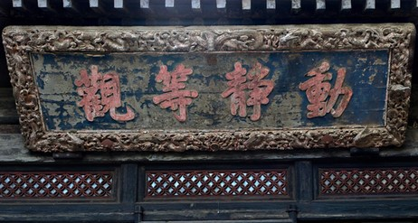

# 人生点滴

***做事有首尾，做人有担当。***

## 以退为进
*Date: 2019/04/18*

*手把青秧插满田，*  
*低头便见水中天。*  
*心地清静方为道，*  
*退步原来是向前。 -唐·布袋和尚*

>君子以成德为行，日可见之行也。潜之为言也，隐而未见，行而未成，是以君子弗用也。君子学以聚之，问以辩之，宽以居之，仁以行之。易曰：「见龙在田，利见大人。」 君德也。九三， 重刚而不中，上不在天，下不在田。 故乾乾，因其时而惕，虽危无咎矣。九四， 重刚而不中，上不在天， 下不在田，中不在人，故或之。或之者，疑之也，故无咎。夫大人者，与天地合其德，与日月合其明，与四时合其序，与鬼神合其吉凶。 先天下而天弗违，后天而奉天时。 天且弗违，而况於人乎？ 况於鬼神乎？亢之为言也，知进而不知退，知存而不知亡，知得而不知丧。其唯圣人乎？***知进退存亡，而不失其正者，其为圣人乎？*** - 《易经·乾卦》

世间的事，都是相对的，其实本没有对错，进与退，本也无所谓。一旦人有了想法和追求，“进”成了世人实现目标唯一的选择，可是你见过只上不下的东西吗？你见过只增不减的东西吗？每天大家都可见的多是圆运行，太阳有升有降，股市有涨有跌。如同扔回旋镖一样，你要得，先要舍；你要进，先要退。月有阴晴圆缺，人有悲歡離合，有阴就有阳，有有就有无，对立的两方相互转换、相依而存。

动静等观，观等动静。

## 认真
*Date: 2019/04/19*

认真是好事，要用对地方，掌握[火候](#火候)。

## 火候
*Date: 2019/04/19*

*火候，做菜时用火时间和大小的把握。*

火候是分寸的拿捏。

做一件事情，最难的是对处理火候的把握。把握的恰到好处，大家都舒心，事情也顺利；不及则力度不够，事情推不动；过份则用力过猛，显得矫情，不自然。

一件事情会做以后，除了不断改进方式、方法外，更多的体现在对火候的把控。这是高手和低手的最大区别。这种把控，蕴藏在看似不经意的平常一举一动中，普普通通，却又极难超越，极难模仿。

火候体现一个人的悟性积累。

## 心思缜密
*Date: 2019/04/22*

心思缜密可以是褒义，也是是贬义。看做什么事，对什么人，在什么场合，应什么景。

心思缜密又有大气魄的人，少见。事事都沉浸在小概率里面用大炮打蚊子，确实有点浪费炮弹。人的精力有限，把有限的生命浪费在无限的打蚊子中，愚蠢！

有些事情，看似简单，实则极难。心思缜密的人往往容易陷入其中，试图拿着技术这把锤子，可以解决所有问题。当然，不仅是心思缜密的人会掉进这个坑，其他人偶尔也会。不同的是，谁会自己选择入坑，同时乐此不疲、津津有味。

但在有些场景下，把心思拿出来密密的筛一筛，用完就走，学习一下微信的设计哲学，倒也未尝不可。这是不是也是[火候](#火候)的把握呢？

盐不能当饭吃。

