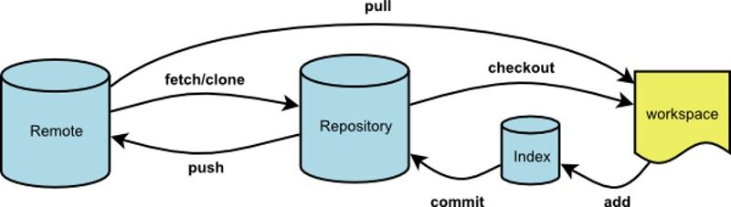

# Git

## Git基本资料

- [Git官方文档](https://git-scm.com/docs)
  最权威的Git解释。
  
- [Pro Git中文版](https://git-scm.com/book/zh/v2)
  Git详细讲解。

- [图解Git](http://marklodato.github.io/visual-git-guide/index-zh-cn.html)
  图文并茂，用例子说明原理，推荐！

- Git基本操作

- [Git命令图表](http://ndpsoftware.com/git-cheatsheet.html#loc=remote_repo;)

- 常用Git命令

| 用途                     | 命令                                      |
|------------------------| ----------------------------------------- |
| 克隆代码库               | git clone https://username.github.com/rep |
| 下拉代码                 | git pull                                  |
| 把工作区代码放入Stage中  | git add .                                 |
| 把Stage代码提交到Local库 | git commit -m "..."                       |
| 把Local库推到远程库      | git push                                  |
| 回退版本到指定变更集     | git reset --hard 67233                    |
| 查看本地库状态           | git status                                |

## [VFS For Git](https://vfsforgit.org/)
微软出品，为支持大型系统而生。

