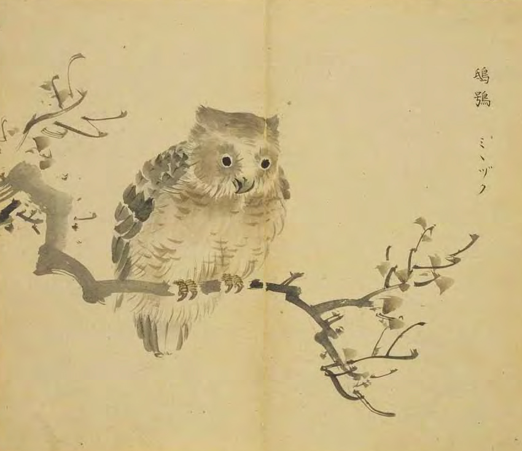

# 管理杂记

*杂七杂八，想到就说。*

## 可持续发展
*Date: 2019/04/16*

对一个组织来说，可持续发展非常重要。所谓百年老店、基业长青，都是可持续发展的结果。一个企业，一个组织，即使当时再红火、再强大，也抵不过事境的变迁，唯有持续改进，可以穿越时代长河。

可持续发展，就是要求与环境相适应的，有正确的方向，长远的考虑，持续改进的机制，面对变化，不断调整。

## 处理与解决
*Date: 2019/04/18*

有些事情，无法解决，只能处理。  
有些系统问题，只能处理，无法解决。

## 一个好的系统...
*Date: 2019/04/18*

*无所感知，无所不在。*  
一切运行良好的东西，最高境界是你几乎会忘记他的存在，但他却无处不在。对于组织、设计、系统无不如此。达到这样的境界，是遵循客观规律的结果，是适配外部环境的结果。  

现实中却正在相反，运行良好的系统，往往不会受到关注和重视。

## 微观与宏观
*Date: 2019/04/18*

*窥一斑而知全豹*  

微观与宏观看似是一对矛盾，两者间好似并无关联，其实不然。  
如果仔细观察和思考，微观中的一些现象和道理都可以在宏观中找到类似的映射，反之亦然，两种环境下表现出的现象大致相同中又有不同之处，这大概就是太极图中所表现的“阳中有阴，阴中有阳”。  
以此类推，你还可以发现，局部与整体，此时与未来，也有类似的关联关系。  
有点玄，是吗？  
我经常说，观察一个社会，不一定要到社会中去，从身边的事物的局部就可以体现。比如从系统的源代码中。:)  再比如马路。
相信吗？不信可以试着去体现、感悟一下！

## 可以慢，不能停
*Date: 2019/04/18*

*龟兔赛跑*  
你是否有过这样的情形：
- 某个瞬间冒出一个想法，这样这样做会更好，大家展开讨论，热烈非凡，但是哈，一天过后，一切如故。
- 做一件事情，想了一段时间，或成熟，亦或不成熟，一忙起来，就搁置了，不了了之。

其实许多该做没做的事情，原因可能是还想再想想，可能是一忙就忘了。做这件事的因缘还在，但时机已过，心气没了，种子也就无法发芽成长。  

>把事情先运转起来比什么都重要！

如果你想不清楚，不如先试着往前迈一小步，没准会如同突然穿越迷雾一般豁然开朗，在运转中产生新的思考、新的火花，是推动事情的好办法！

如果你暂时想不清楚，不妨用图或文字写下来，捋一捋思路，或许转机就在眼前。

如果你想做的事情很庞大，无从下手，不妨从一件小事做起，也许这件小事就是开启问题之门的钥匙。

如果你这一段时间挺忙，需要先把规划的事情放一放，请保持警惕，不要犯龟兔赛跑的问题。

总之，关键在于把事情运转起来，可以慢，不能停！

## 未雨绸缪
*Date: 2019/04/23*

*未雨绸缪 OR 亡羊补牢*

[《诗经·豳风·{鸱鸮|chī xiāo}》](https://sou-yun.cn/Query.aspx?type=poem&id=263)：「迨天之未阴雨，彻彼桑土，绸缪牖户。」  {迨|dài,趁着}, {牖|yǒu,窗户}
意思是：鸱鸮在未下雨时就啄来桑树皮，修补鸟巢。  

 
图片引用自[搜韵](https://sou-yun.cn/Query.aspx?type=poem&id=263)。感谢！ 

对于做一个长期维护项目，做到“未雨绸缪”非常重要。这意味着要主动感知外界的变化，提前对未来可能产生的局面进行主动应对，用史蒂夫·柯维的[《高效能人士的七个习惯》（又译为：《与成功有约》）](https://book.douban.com/subje/t/1007949/)上的说法，叫做作“重要不紧急”的事，“重要不紧急”的事在将来会变成“重要且紧急”，真到这时，只能仓促、被动应对。所以，你是否经常在疲于奔命，无暇顾忌前方的道路，如果已经处在这种状态，就需要认真分析一下，原因是否就是不够“未雨绸缪”，才造成今天“亡羊补牢”的局面。

人往往是有惰性的，安安稳稳，得过且过，日子是很好混的。主动谋划，占领先机，勇于变革，需要克服重力加速度，只有有追求的组织，才会“犯傻”想未来。

“未雨绸缪”是[可持续发展](#可持续发展)的特征之一。

## 目标与手段
*Date: 2019/04/25*

做管理，很重要的一点是要区分目标与手段。目标不变，手段可以是多样的、变通的，做为管理者，往往在手段上有自己的喜好，在选用哪种手段上着力过多，忽视了达成目标的重要性。

## 绩效考核
*Date: 2019/05/04*

陈皓：[我看绩效考核](https://coolshell.cn/articles/17972.html)

> 作者的观点：  
> 1) 制定目标和绩效，目的不是用来考核人的，而用来改善提高组织和人员业绩和效率的。
>
> 2. 人是复杂的，人是有状态波动的，任何时候都不应该轻易否定人，绩效考核应该考核的是事情，而不是人。
>
>KPI本身是一种被动的、后置的考察，在工作完成之后考察员工的行为是否符合标准。因此，员工对于公司的目标漠不关心，只关心自己的KPI，因为这才是自己的最大的利益，为了达到KPI，有的员工开始不思考，并使用一些简单粗暴的玩法，其实这样既害了公司，也害了自己。自己的成长和进步也因为强大的 KPI 而抛在了脑后。
>
>当然，KPI 绩效考核一般来说，不一定会毁掉公司的，相反，对于喜欢使用蛮力的劳动密集型的公司来说，可能还有所帮助，然而，KPI毁掉的一定是团队的文化和团队的挑战精神，以及创新和对事业的热情，甚至会让其中的人失去应有的正常的判断力（分不清充分和必要条件，分不清很多事的因果关系）。

新闻：[绩效主义毁了索尼](http://tech.qq.com/a/20120614/000196.htm)

>索尼连续4年亏损，去年更亏损63亿美元。为什么?绩效主义毁了索尼!因实行绩效主义，职工逐渐失去工作热情。在这种情况下是无法产生“激情集团”的……公司为统计业绩，花费了大量的精力和时间，而在真正的工作上却敷衍了事，出现了本末倒置的倾向
......
>
>因实行绩效主义，职工逐渐失去工作热情。在这种情况下是无法产生“激情集团”的。为衡量业绩，首先必须把各种工作要素量化。但是工作是无法简单量化的。公司为统计业绩，花费了大量的精力和时间，而在真正的工作上却敷衍了事，出现了本末倒置的倾向。
因为要考核业绩，几乎所有人都提出容易实现的低目标，可以说索尼精神的核心即“挑战精神”消失了。因实行绩效主义，索尼公司内追求眼前利益的风气蔓延。这样一来，短期内难见效益的工作，比如产品质量检验以及“老化处理”工序都受到轻视。
......
>
>“建立公司的目的：建设理想的工厂，在这个工厂里，应该**有自由、豁达、愉快的气氛**，让每个认真工作的技术人员最大限度地发挥技能。”这正是索尼公司的创立宗旨。索尼公司失去活力，就是因为实行了绩效主义。

转引:《Do the Right Thing, Wait to get fired》中提到《 Team Geek》中的一句话:
>
> 做正确的事情，等着被开除。
>
>谷歌新员工(我们称做“Nooglers”)经常会问我是如何让自己做事这么高效的。我半开玩笑的告诉他们这很简单：我选择做正确的事情，为谷歌，为世界，然后回到座位上，等着被开除。如果没有被开除，那我就是做了正确的事情——为所有人。如果被开除了，那选错了老板。总之，两方面，我都是赢。这是我的职业发展策略。

陈皓：[我看绩效考核](https://coolshell.cn/articles/17972.html)
> 考试分数不是关键，别人对你的评价也不是关键，自己有没有成长有没有提高有没有上一个台阶才是关键。KPI不是关键，OKR也不是关键，有没有在做正确的事，这才是关键！

组织发展总是在历史重演，一遍又一遍。有些组织十月怀胎式的走过万年的发展历程，迅速成长为一个发育良好的有机体；有些组织受到格局、思想、出发点的束缚，到某个临界点后，陷入近似原地踏步的怪圈。

用一颗平常心对待，这只是你成长道路上的一次考验，我们需要做的是：做正确的事情，等着被开除。

深以为然！

