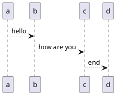
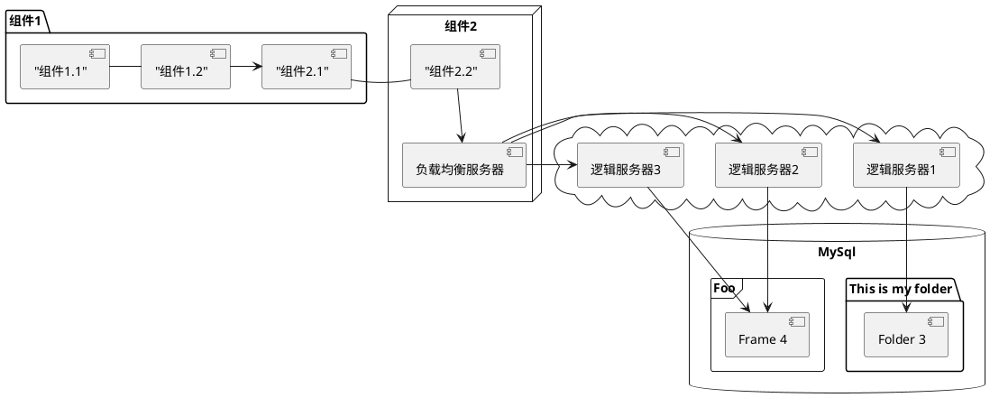
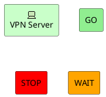

# TEST IT

<!-- @import "[TOC]" {cmd="toc" depthFrom=2 depthTo=3 orderedList=false} -->
<!-- code_chunk_output -->

* [Test Markdown All-in-one plugin](#test-markdown-all-in-one-plugin)
* [Test gravizo](#test-gravizo)
* [Test Sequence Diagrams](#test-sequence-diagrams)
* [test mermaid](#test-mermaid)
* [test plantuml](#test-plantuml)

<!-- /code_chunk_output -->

## Test Markdown All-in-one plugin

{汉|han}

## Test gravizo

test **<https://g.gravizo.com/svg?>...**，在线生成各种图：


## Test Sequence Diagrams

```sequence
cc-->bb: Hello
note right of bb: This is a question
```

## test mermaid


## test plantuml







```plantuml
@startuml
!includeurl https://raw.githubusercontent.com/ebbypeter/Archimate-PlantUML/master/Archimate.puml

title Archimate Sample - Requirement & Application Services

'Elements'
Motivation_Requirement(ReqPayrollStandard, "Do Payroll with a standard system")
Motivation_Requirement(ReqBudgetPlanning, "Do budget planning within the ERP system")

Application_Service(ASPayroll,"Payroll Service")
Application_Service(ASBudgetPlanning,"Budget Planning Service")
Application_Component(ACSAPFinanceAccRec, "SAP Finance - Accounts Recievables")
Application_Component(ACSAPHR, "SAP Human Resources")
Application_Component(ACSAPFin, "SAP Finance")
Application_Component(ACSAP,"SAP")

'Relationships'
Rel_Realization_Up(ASPayroll, ReqPayrollStandard)
Rel_Realization_Up(ASBudgetPlanning, ReqBudgetPlanning)
Rel_Realization_Up(ACSAPFinanceAccRec, ASBudgetPlanning)
Rel_Realization_Up(ACSAPHR, ASPayroll)

Rel_Composition_Up(ACSAPFin, ACSAPFinanceAccRec)
Rel_Composition_Up(ACSAP, ACSAPHR)
Rel_Composition_Up(ACSAP, ACSAPFin)
@enduml
```
