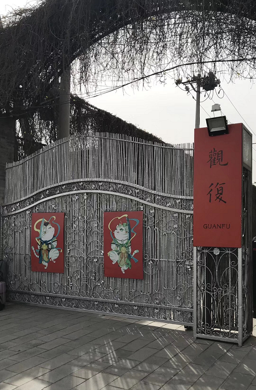

# 观复行
> 2019年4月7日 / 己亥年 戊辰月 甲戌日

与古人对话，与文化同行。

观复博特馆，久闻其名，一直不得从行。清明节当日，因缘成熟，得以成行。

观复位于北京朝阳区东北郊，小院外并无异于常境之处。停车，买票，踏入小院，院内别有洞天，另有一番情趣。

小院里的猫馆长们“各司其职”，有的在睡觉，有的在巡逻，还有的逗游客。在猫馆长的眼里，我们是过客。

在观复博物馆中，处处可以感受到工作人员的用心，讲解，展品设置，贴心的提醒，角落里的小鱼池，小方凳的修复过程展示。不一而足，从细微处观整体，透出的是心态与心境。
