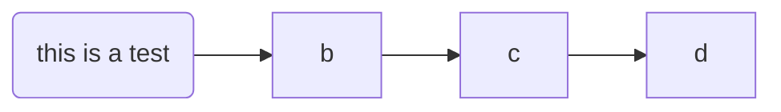
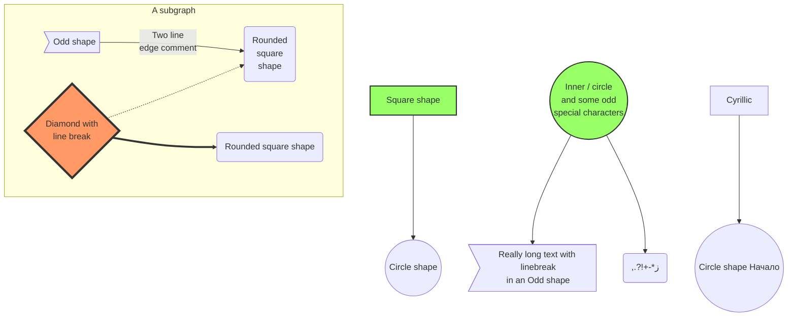
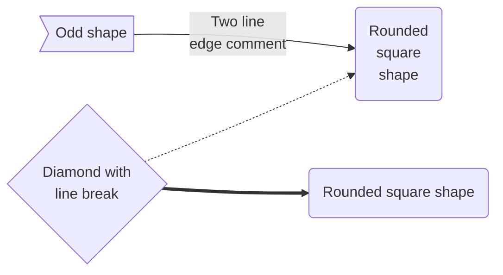
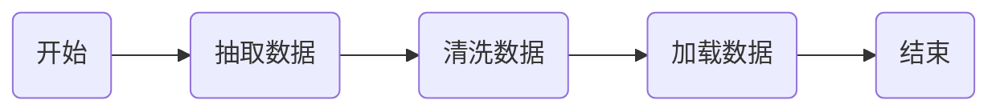
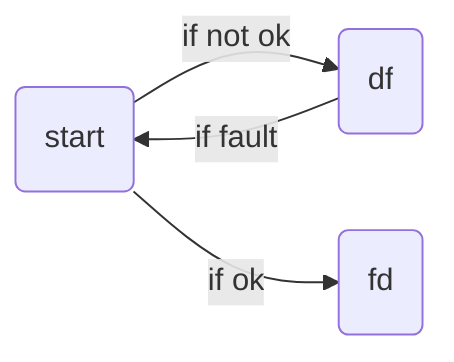

# mermaid example


```mermaid
graph TD;
    A-->B;
    A-->C;
    B-->D;
    C-->D;
```


```mermaid
graph LR
    b-->c
    c-->d
    id1(this is a test)-->b
```


```mermaid
graph TB
    sq[Square shape] --> ci((Circle shape))

    subgraph A subgraph
        od>Odd shape]-- Two line<br>edge comment --> ro
        di{Diamond with <br/> line break} -.-> ro(Rounded<br>square<br>shape)
        di==>ro2(Rounded square shape)
    end

    %% Notice that no text in shape are added here instead that is appended further down
    e --> od3>Really long text with linebreak<br>in an Odd shape]

    %% Comments after double percent signs
    e((Inner / circle<br>and some odd <br>special characters)) --> f(,.?!+-*ز)

    cyr[Cyrillic]-->cyr2((Circle shape Начало));

     classDef green fill:#9f6,stroke:#333,stroke-width:2px;
     classDef orange fill:#f96,stroke:#333,stroke-width:4px;
     class sq,e green
     class di orange
```


```mermaid
    graph LR
        od>Odd shape]-- Two line<br>edge comment --> ro
        di{Diamond with <br/> line break} -.-> ro(Rounded<br>square<br>shape)
        di==>ro2(Rounded square shape)
```


```mermaid
graph LR
    start(开始)-->chouqu(抽取数据)
    chouqu-->id3(清洗数据)
    id3-->id4(加载数据)
    id4-->eid5nd(结束)
```


```mermaid
graph LR
	id1(start)--if not ok-->id2(df)
	id1(start)--if ok-->id3(fd)
	id2--if fault-->id1

```

``` flow
start:st=>ids

```


